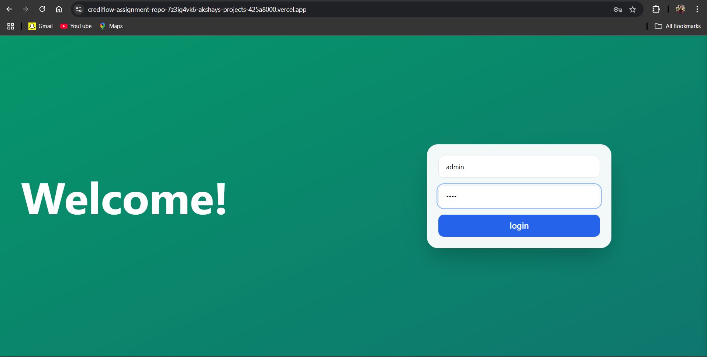
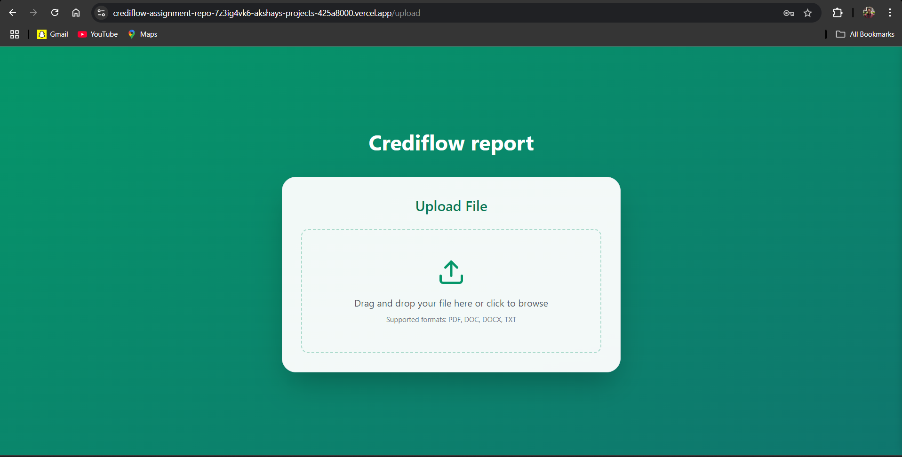
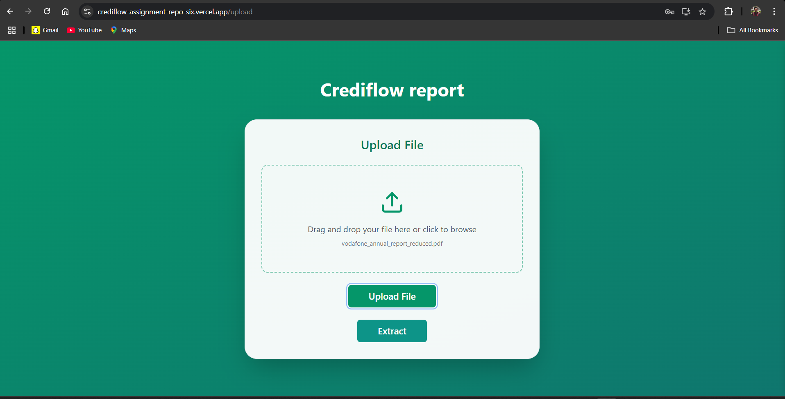
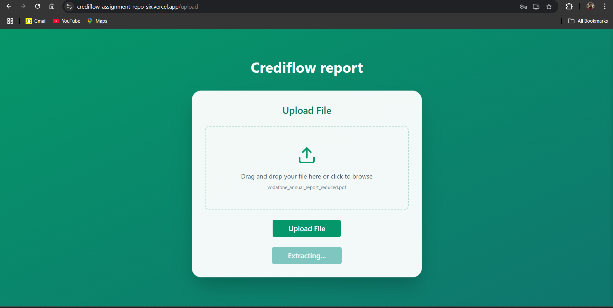
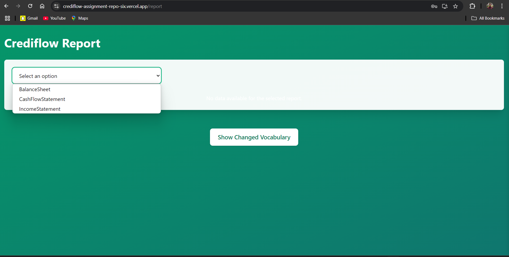
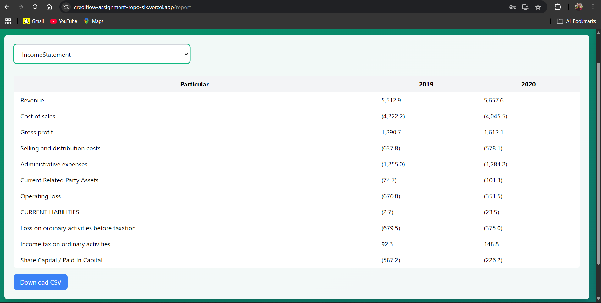
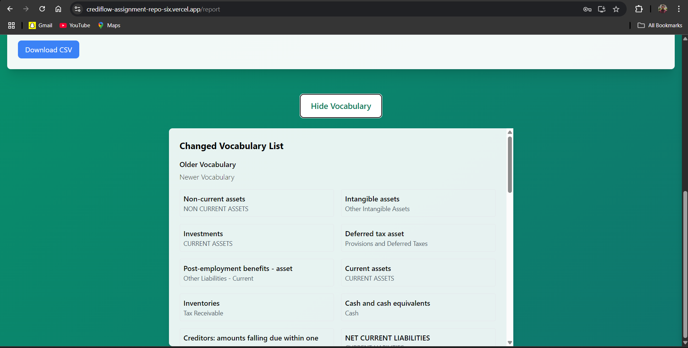

# Crediflow Assignment - PDF data extractor

This platform is used to extract financial data from pdf file 

##  Overview

This is a full-stack document analysis platform that allows users to upload documents (.PDF), extract Balance sheet, Income statement, Cash flow data from them using multimodalLLM inference (via Groq), and generate structured, readable table. It's built using:

-  **React** for the frontend
-  **Python ** for the backend
-  **Groq** as the LLM inference engine
-  **meta-llama/llama-4-scout-17b-16e-instruct** as the multimodalLLM used

---

##  Tech Stack

| Layer        | Technology     |
| ------------ | -------------- |
| Frontend     | React,  |
| Backend      | Python, flask |
| LLM Inference| Groq API       |
| Deployment   | EC2 for backend , Vercel for frontend |
| File Handling| REST + File Uploads |
| Cloudinary   | Image hosting |  

---

##  Project Structure
project-root/  
├── frontend/ # React frontend  
├── backend/ # Python backend  
│ ├── app.py  
│ ├── uploads/ # Uploaded files (saved in subfolders)  
├── screenshots/ 

---

## Backend Setup 
cd backend  
python3 -m venv venv  
source venv/bin/activate  
pip install -r requirements.txt  

Create a .env file for Groq API and cloudinary credentials and configuration.

### Start the Flask server (in dev mode):
python app.py
Or use Gunicorn for production:  
nohup gunicorn -w 1 -b 127.0.0.1:5000 --timeout 240 app:app &  

## Frontend Setup 
cd frontend  
npm install  
npm run dev   # or npm run build && npm start for production  

---

## API Endpoints

POST	https://amazingly-allowing-stag.ngrok-free.app/upload/   ####	Uploads a document  
  file:filename.pdf  
POST	https://amazingly-allowing-stag.ngrok-free.app/start-process	#### Triggers LLM inference via Groq for the uploaded pdf.  
  {fileName:filename.pdf} 

---

# Screenshots
### login
    

### upload file  
  

### Extract data  
  

### Report data  
  
    
    

## Vocabulary change
While giving the final data from extracted table, this project changes the labels from the extracted data to the ones closely matching with the provided vocabulary list  
The process used to identify the closely matching words from the vocabulary for the labels is by using spacy similarity. 
This is not 100% accurate solution , and can sometimes give false reuslt .  
currently a threshold is set to change the labels whose score is above the threshold. setting a higher threshhold can increase accuracy but can missout on some terms.  

---
### blockers faced.
- Finding a good free multimodal LLM  
  Tried a bunch of LLM APIs that support both text and image input. Most had very limited free usage (token caps, image limits, or super low API rate limits). Finally settled on Groq — it wasn’t perfect, but had decent limits for what I needed.

- LLM only allows 5 images per call
Since I couldn’t just dump the entire PDF into the model, I had to figure out a way to pick the 5 most relevant pages.

- OCR was tricky
Using Tesseract to extract text from PDF pages worked, but not always cleanly. Some pages were noisy or had weird layouts, so the text needed a bit of cleanup.

- Vocabulary - Relabelling
  Since LLM had token limits , could not make use of them to pass the vocabulary to them and relabel while extracting the pdf data.

### Solutions
- Built a page ranking script  
    Took the PDF, converted each page to an image, ran Tesseract OCR, and then scored each page based on:  
    - Presence of keywords like "balance sheet", "income statement", etc.  
    - How many numbers were on the page (more numbers = more likely it's financial data)  
  Picked the top 5 scoring pages to send to Groq.

- Used spaCy to clean up labels
  Since using LLM for relabelling was not a choice,I used spaCy's similarity matcher to compare each label to a predefined list of financial terms and swapped in the closest match.  
  Not a 100 percent accurate solution but can give a fair result. Defined a threshold parameter to exchange those labels only with higher matches. increasing the threshold can help a good result but can missout on certain terms.

### in future 
- Improve Multimodal LLM for Data Extraction  
The current setup relies on multimodal LLMs for extracting data from financial documents. In the future, we can use fine-tuned models to improve accuracy, reducing the need for any additional pre-processing steps like page selection. By using advanced techniques, we could allow the model to extract relevant data from entire documents, including tables, images, and text, without the need for manual page filtering.

- Reducing inference time  
  The current app takes almost 1-2 minutes to correctly extract data and produce an output. the major part in contributing to this time is the preprocessing part where the pdf image is preprocess to find relevant pages using ocr. If we can use LLM to do this , then the only worry will be about the LLM inference time. Also the free hosting with limited usage (ec2 free tier ) affects the performance to run this script.

---
# Live app:
https://crediflow-assignment-repo-six.vercel.app/  
Please note , inference can take 1  - 2 minutes due to hosting in free tier which affect the performance.   
sample file -> https://github.com/akshay-op/crediflow_assignment_repo/blob/main/vodafone_annual_report_reduced.pdf

 
    

